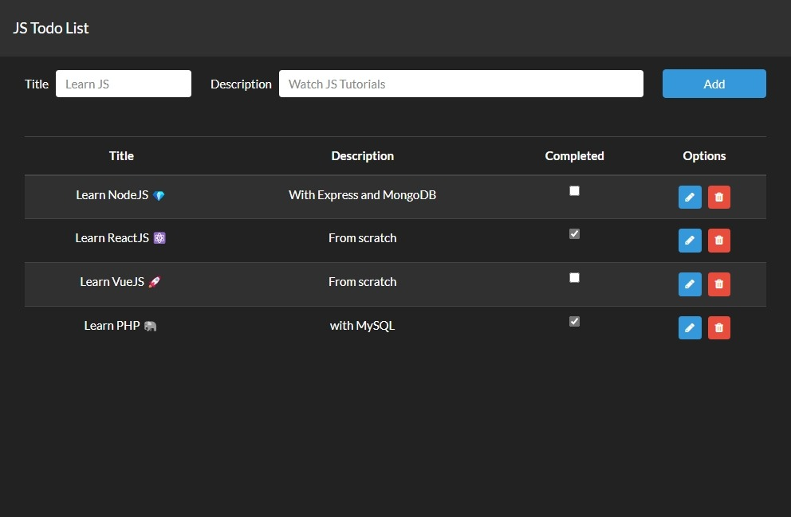

# Vanilla Javascript Todo List 

## Table of Content

- [About The Project](#about-the-project)
  - [Description](#description)
  - [Built With](#built-with)
- [Installation](#installation)
- [Usage](#usage)
- [Demo](#demo)
- [Contact](#contact)

## About The Project



## Description

This project is from a task application that I made to practice manipulating the DOM with OOP and Javascript, also persisting the tasks in the browser's LocalStorage and for the UI I used a variation of Bootstrap.

## Built With

[](https://developer.mozilla.org/es/docs/Web/HTML)

[](https://getbootstrap.com)

[](https://www.javascript.com)

[](https://jquery.com)

## Installation

1. Clone the repo and change "my-project" to your project name.

```sh
  git clone https://github.com/josemiguel02/JS-Vanilla-TodoList.git ./my-project
```

2. Go to the project directory and open in VSCode

```sh
  cd my-project
  code .
```

3. In VSCode type CTRL+P, type **ext install ritwickdey.liveserver**

## Usage

Click to **Go Live** from the status bar to turn the server on/off.

## Demo

- [View demo](https://josemiguel02.github.io/JS-Vanilla-TodoList)

## Contact

- Gmail - [josemidev24@gmail.com](mailto:josemidev24@gmail.com)
- Instagram - [@jmdp.02](https://www.instagram.com/jmdp.02)
